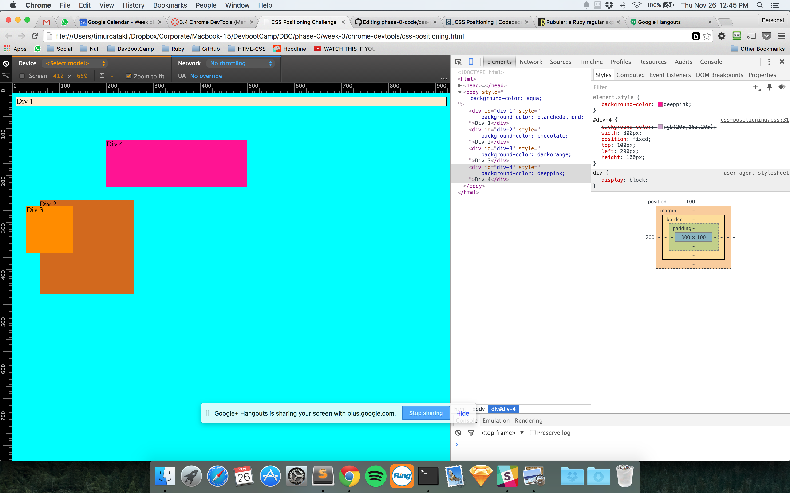
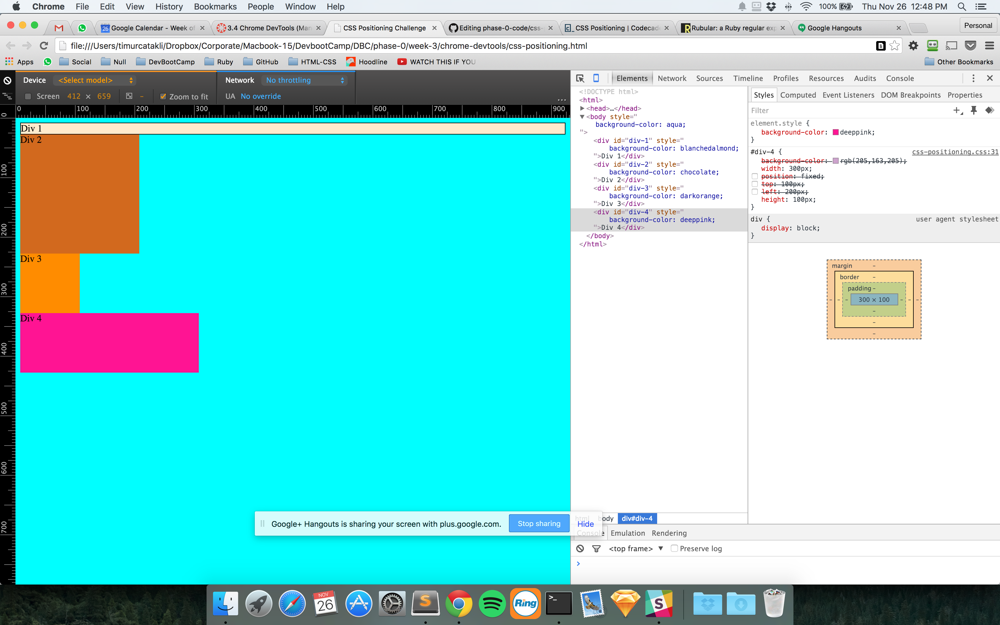
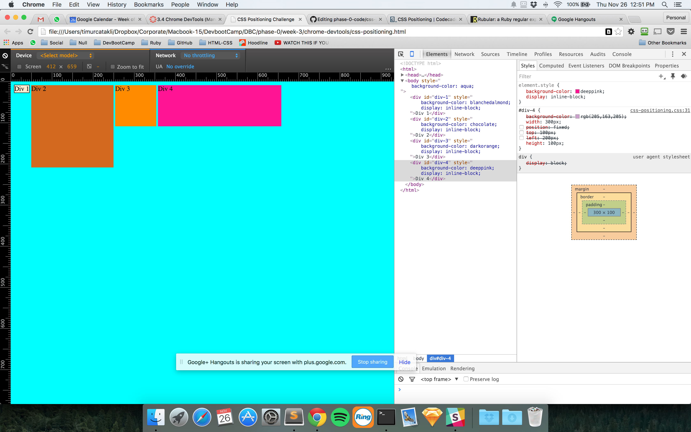
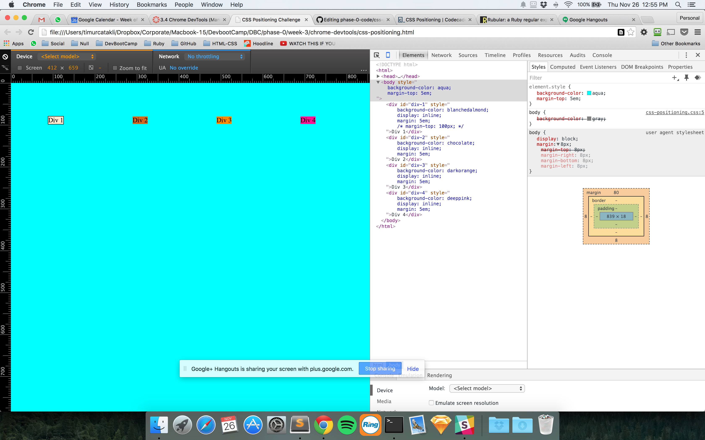
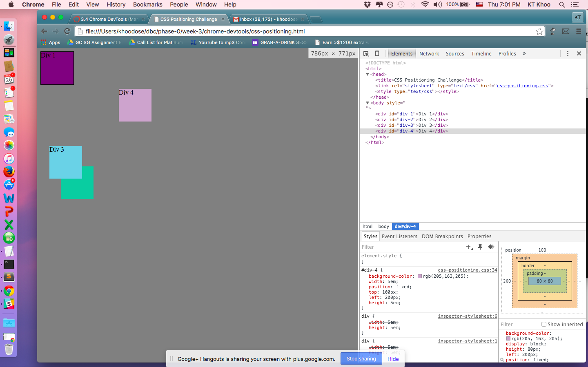
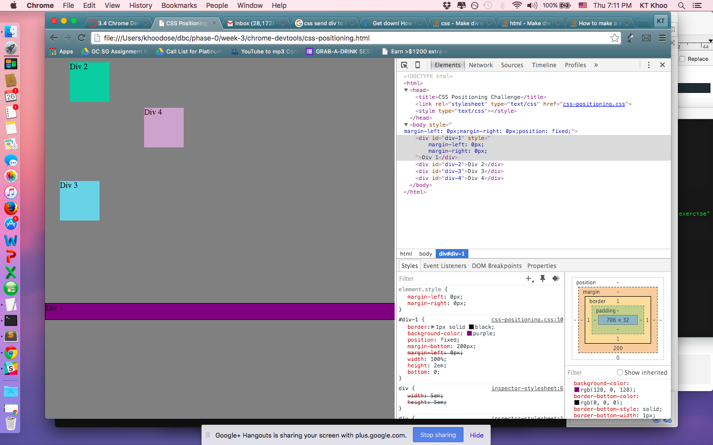
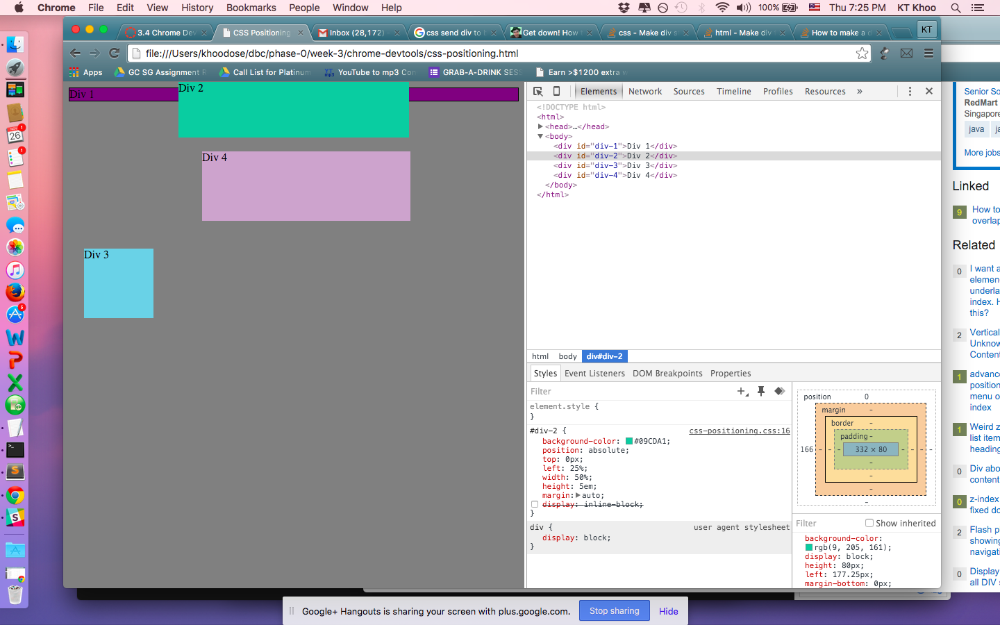
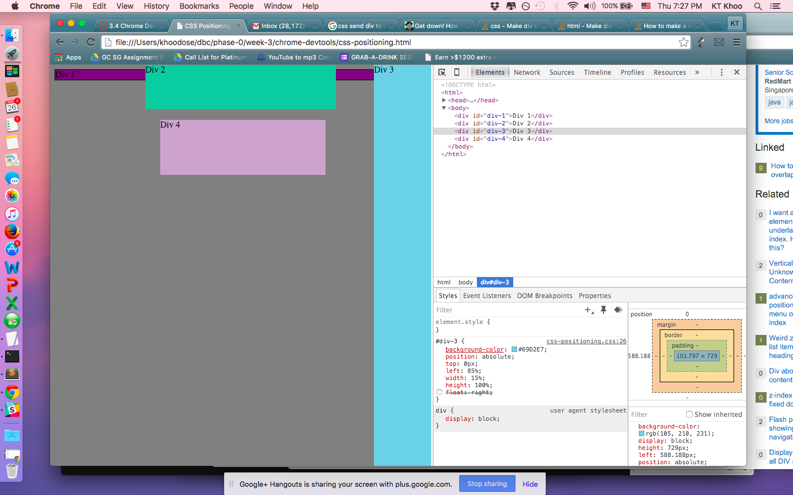
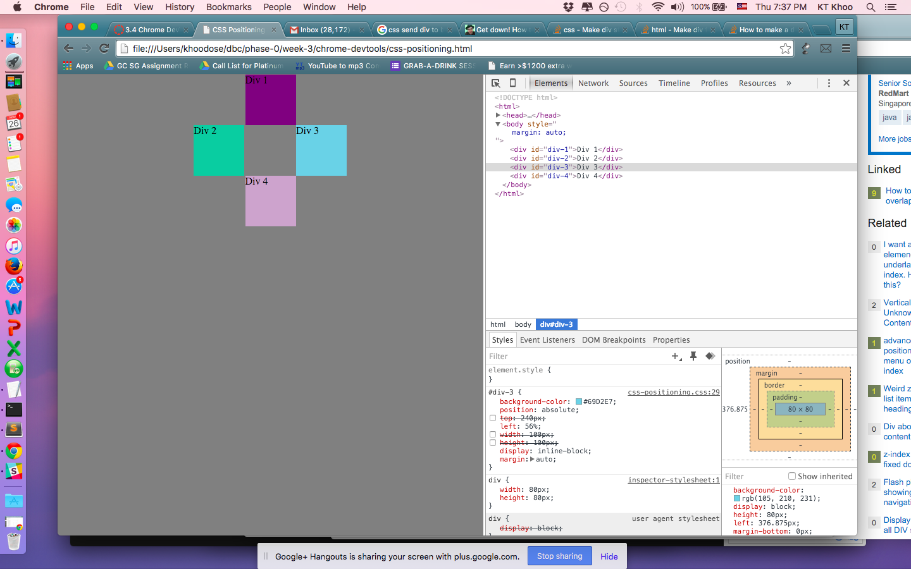

Here are my images

**How can you use Chrome's DevTools inspector to help you format or position elements?**

Using the inspector, you get to view the elements and the styles and the preview all together and you can click on the elements and view and edit their properties in the stylesheet.

**How can you resize elements on the DOM using CSS?**

By going to the element styles and changing the relevant properties like width and height, using px or % or em.

**What are the differences between absolute, fixed, static, and relative positioning? Which did you find easiest to use? Which was most difficult?**

static is default the way it is positioned by the browser in the flow of the page. relative is "relative" to the normal position of the element.  fixed is always fixed at a certain part of the page regardless of scrolling and resizing.  absolute is a way of "fixing" the element relative to its parent / ancestor.  I think static was the easiest to understand.  Maybe the difference between fixed and absolute was a little harder to understand initially.

**What are the differences between margin, border, and padding?**

margin is between the element and other elements, border is the line around the element, padding is what's between the border and the content of the element.

**What was your impression of this challenge overall? (love, hate, and why?)**

Was interesting and good to get live feedback as you edited in the browser.  Some parts were a little trickier and frustrating, like how to work with position and margins and get stuff to center properly.
